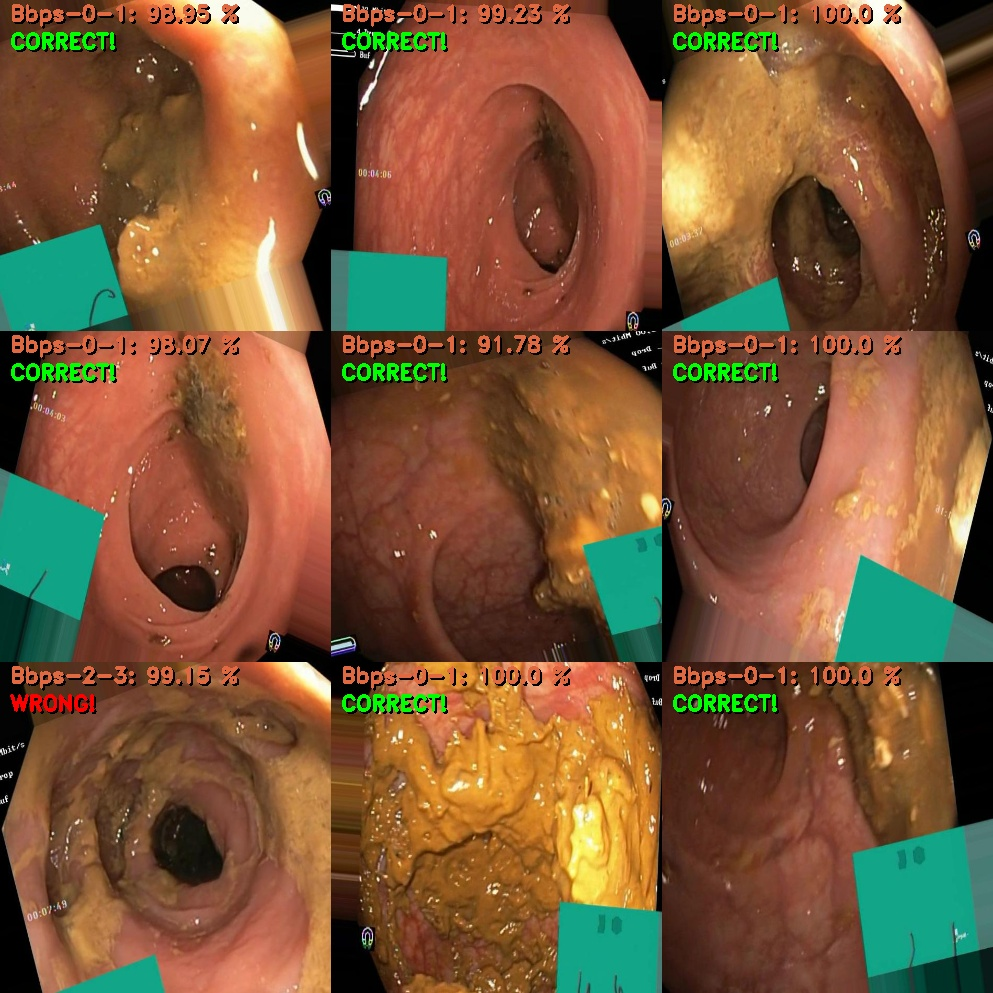
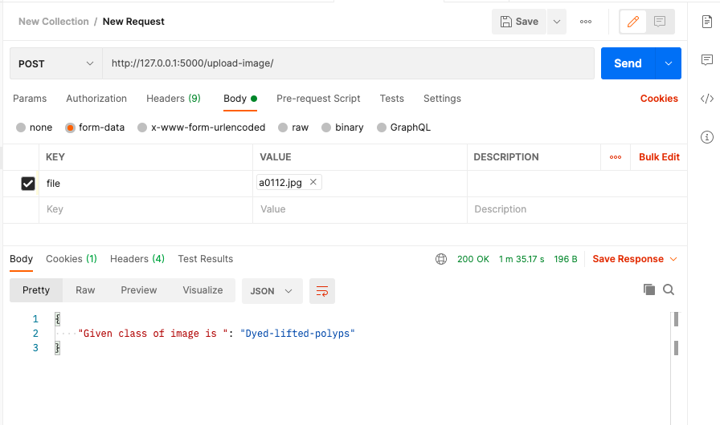

# ML_ModelPrediction

# Docker Image:

https://hub.docker.com/repository/docker/rsingh95/endoscopic_guidance
 
 
 
# Perdiction of the mutiple trained models (NASNet, RESNET, VGG16 VGG19, DENSENET) to be integrated with micro service using Flask API request.

Image is updated and loaded on MongoDB for future use, and the user gets a response of the predicted lable while using service and upload image for prediction.

## POST Service 
* http://127.0.0.1:5000/upload-image/

´´´
Payload as image file only ion .jpeg format
´´

Response: 
{
    "Given class of image is ": "esophagitis-a"
}

## GET Service 
* http://127.0.0.1:5000/prediction-history/

Response Json from monogo DB:

          [
             {
                 "file_name": "ileum_0_7352.jpg",
                 "predicted_label": "ileum",
                 "predicted_time": "01-Apr-2021 (18:44:33.998778)"
             },
             {
                 "file_name": "bbps-0-1_0_9233.jpg",
                 "predicted_label": "bbps-0-1",
                 "predicted_time": "01-Apr-2021 (18:45:38.009416)"
             },
             {
                 "file_name": "bbps-2-3_0_7472.jpg",
                 "predicted_label": "bbps-2-3",
                 "predicted_time": "01-Apr-2021 (18:46:30.757385)"
             },
             {
                 "file_name": "z-line_0_8973.jpg",
                 "predicted_label": "z-line",
                 "predicted_time": "01-Apr-2021 (18:47:15.678880)"
             }
         ]

    

#NASNET MODEL PREDICTION

Image is updated and loaded on MongoDB for future use, and the user gets a response of the predicted lable while using service and upload image for prediction.

## RESNET MODEL PREDICTION

